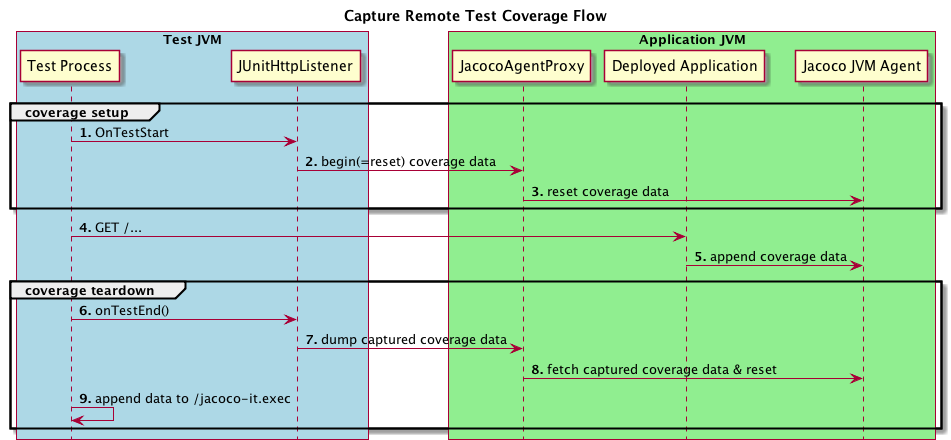

# Capturing remote/ui acceptance test code coverage results using JaCoCo

## Overview

Jacoco comes with out-of-the-box implementations for capturing test coverage information from a remote process over TCP by ['output=tcpserver|tcpclient' agent configuration](http://www.eclemma.org/jacoco/trunk/doc/agent.html), but in modern Cloud-deployment environments (e.g. Cloudfoundry) it is not always possible or desirable to know the concrete TCP addresses in advance or connect directly to a port other than HTTP/HTTPS.

This sample explores how to capture the test coverage information from a remote process using [Jacoco](http://www.eclemma.org/jacoco/index.html) and [SonarQube](http://www.sonarqube.org/) over HTTP. This is particularly useful for HTTP-based applications.

## Prerequisites

The below describes an example setup of Sonar using MySQL as db backend (see also http://chapter31.com/2013/05/02/installing-sonar-source-on-mac-osx/) and has been
tested with MySQL 5.6, SonarQube 4.3.1 and Maven 3.0.5

1. MySQL for SonarQube (e.g.)

    OSX: $>brew install mysql  
    
    create the sonar database using e.g. [create_database.sql](https://github.com/SonarSource/sonar-examples/blob/master/scripts/database/mysql/create_database.sql)
    
    ```
# File: create_database.sql
# Create SonarQube database and user.
# Command: mysql -u root -p < create_database.sql
#
CREATE DATABASE sonar CHARACTER SET utf8 COLLATE utf8_general_ci;
CREATE USER 'sonar' IDENTIFIED BY 'sonar';
GRANT ALL ON sonar.* TO 'sonar'@'%' IDENTIFIED BY 'sonar';
GRANT ALL ON sonar.* TO 'sonar'@'localhost' IDENTIFIED BY 'sonar';
FLUSH PRIVILEGES;
    ```

2. Download and run [SonarQube](http://www.sonarsource.org/downloads/) 4.3 or higher

    OSX: 
    
    a) $>brew install sonar

    b) with (at least) version 4.3.1 there may be a conflict with the currently installed version of ruby on your system (see https://jira.codehaus.org/browse/SONAR-3579)
    in order to fix that, open /usr/local/Cellar/sonar/4.3.1/libexec/web/WEB-INF/config/environment.rb and after the line
  
    ```
ENV['GEM_HOME'] = $servlet_context.getRealPath('/WEB-INF/gems')
    ```

    add  

    ```
ENV['GEM_HOME'] = $servlet_context.getRealPath('/WEB-INF/gems')
# avoid ruby version conflicts
ENV['GEM_PATH']=''
    ```

    c) ensure you have the Sonar Java plugin installed
     
        open http://localhost:9000, login as admin/admin and go to Settings->System->Update Center to install the Java plugin
        
3. Maven 3.0.5

  OSX: $>brew install maven30

## Running

from the toplevel folder of the project run

```
$>mvn clean install 
$>mvn sonar:sonar
```

Now open the project dashboard in Sonar. You should see the IT coverage at 64.0%. Drill down and you should see that both methods (home(), edit()) in HomeController are covered by integration tests. 


## Steps to configure your own project

1. *absolute* file path for jacoco-it.exec coverage record
2. add javaagent to target jvm with output=none
3. add JacocoAgentProxyServletFilter or JacocoAgentProxyController to your servlet application
4. add the JUnit

## How does it work



## TODOs

*) maybe no need to dump() after every request? IT don't support per-test coverage anyway

## Useful Links

http://docs.codehaus.org/display/SONAR/Analysis+Parameters
http://www.eclemma.org/jacoco/trunk/doc/examples/java/ExecutionDataClient.java
http://www.eclemma.org/jacoco/trunk/doc/examples/java/ReportGenerator.java
https://groups.google.com/forum/#!topic/jacoco/04MOA-C22SM
http://docs.codehaus.org/display/SONAR/Code+Coverage+by+Unit+Tests+for+Java+Project
http://dougonjava.blogspot.co.il/2013/07/integration-testing-using-maven-tomcat.html
https://github.com/SonarSource/sonar-examples

